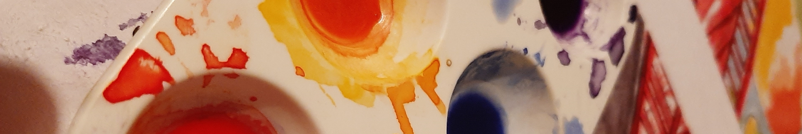
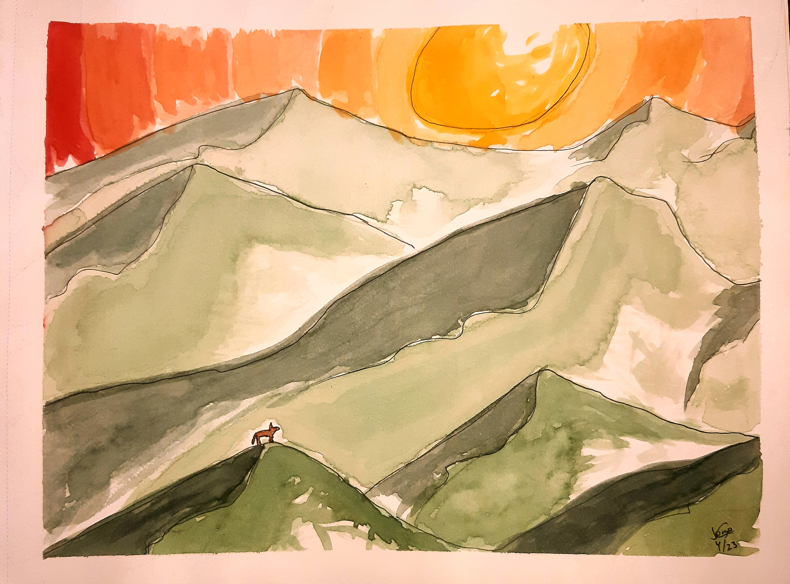

geometry: margin = 0.1in
<body style="background-color:#300020;">

```{r echo=FALSE, layout="l-screen-inset"}
library("knitr")

```


<p style="font-family: times, serif; font-size:40pt; text-align: center; color:#dbd9d9">
     **ART** 
</p>

<p style="font-family: times, serif; font-size:25pt; text-align: center; color:#dbd9d9">
    Watercolor paintings
</p>

<center>
{width=100%}

<center>
{width=100%}

<center>
{width=100%}
