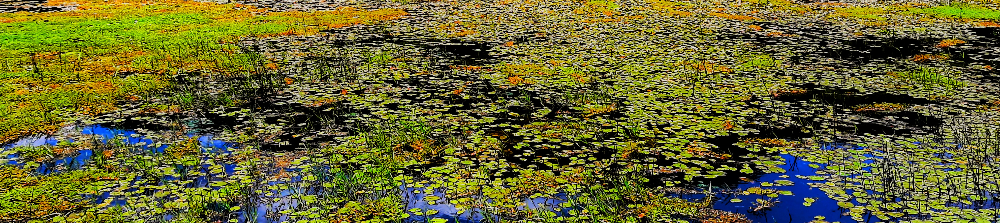

<body style="background-color:#ffe857;">

```{r echo=FALSE, layout="l-screen-inset"}
library("knitr")

```
<p style="font-family: times, serif; font-size:40pt; text-align: center; color:black">
    **BLOG**
</p>

<p style="font-family: accanthis; font-size:12pt; text-align: right; color:black">
<a href="https://www.deepl.com/en/translator" target="_blank"> ***English version*** </a>
</p>

<p style="font-family: accanthis; font-size:15pt; color:black; text-align: left">
**Post inicial** (01/01/2099)
</p>

<p style="font-family: accanthis; font-size:13pt; color:black; text-align: left">
Muy pronto
</p>

<center>
{width=25%}
{width=25%}
</center>
<hr style="border:0.5px solid black">