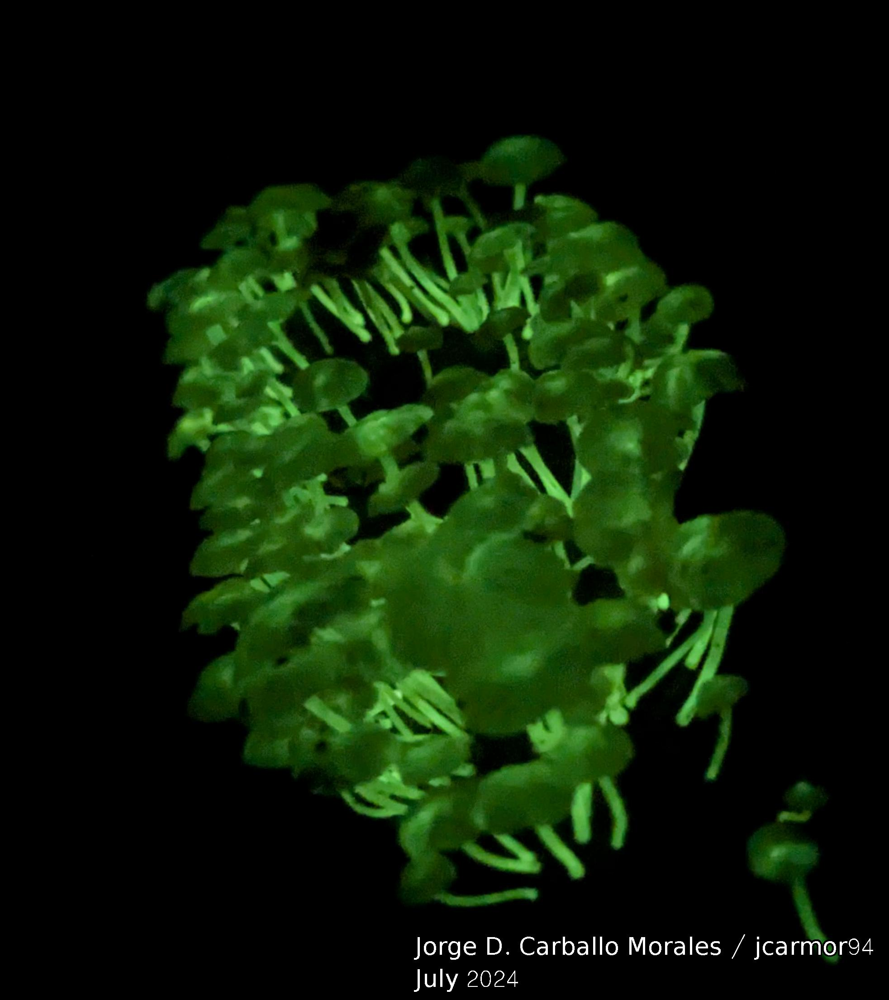
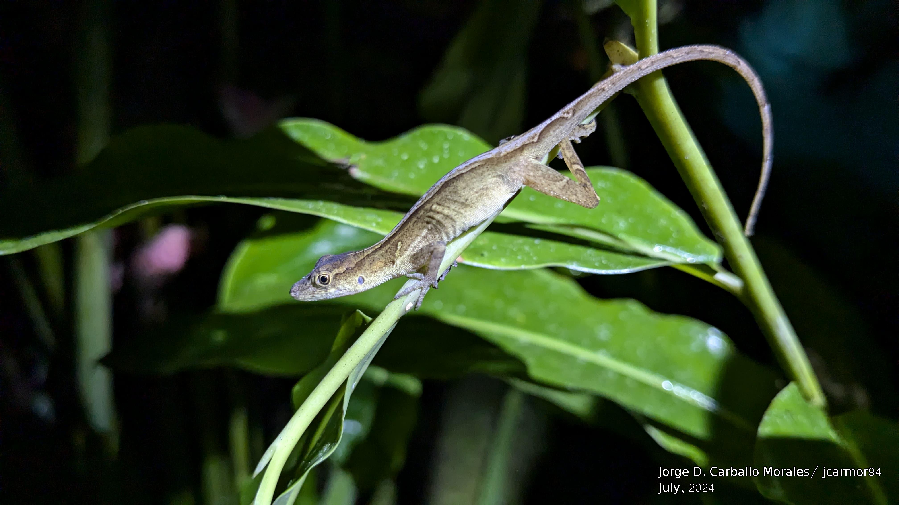
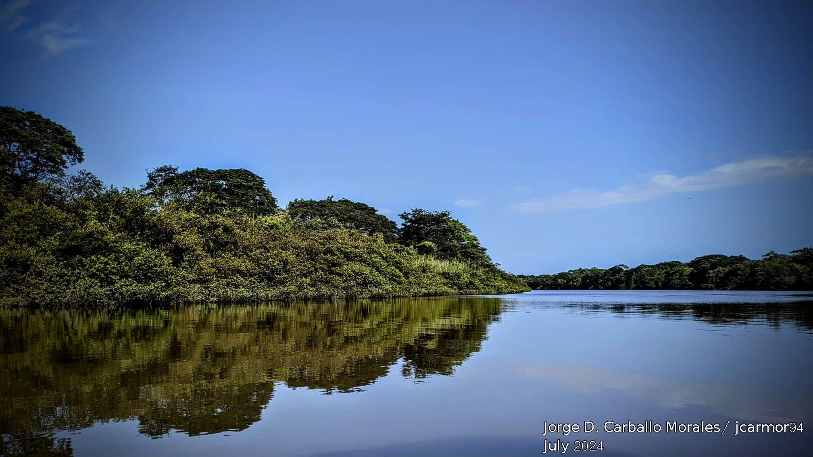

<body style="background-color:#1a1c1c;">


```{r echo=FALSE, layout="l-screen-inset"}
library("knitr")
include_graphics("images/autum.jpg")
```
<p style="font-family: times, serif; font-size:40pt; text-align: center; color:#ff9900">
    **BLOG**
</p>

<p style="font-family: accanthis; font-size:12pt; color:white; text-align: justify">
This blog aims to share some relevant experiences and life-changing events related to my growth as a biologist and scientist.
</p>

</p>
<p style="font-family: accanthis; font-size:15pt; color:white; text-align: center">
TropBio24 (OTS) - My third time as the TA (July, 2024)
</p>

<p style="font-family: accanthis; font-size:11pt; color:white; text-align: justify">
This year, I had the opportunity not just to go back home and visit my family after a year studying in Towson, but also to be the TA for the famous course of the Organization for Tropical Biology: TropBio24. This course presents the opportunity to meet incredible students and professors, mainly from the USA and Latin America, but also people from distant places such as India and South Africa. We visited three different biological stations in Costa Rica and saw many fantastic animals, plants, and other organisms, such as glowing fungi. Find more about the TropBio course <a href="https://tropicalstudies.org/course/tropical-biology-an-ecological-approach/"> _here._ </a>
</p>

<center>
{width=32%}
{width=64%}
<p style="font-family: accanthis; font-size:11pt; color:white; text-align: certer">
Left: Bioluminescent mushrooms in La Selva, Sarapiqui. Right: Anole lizard in Las Cruces, San Vito.
</p>
</center>

<center>
{width=100%}
<p style="font-family: accanthis; font-size:11pt; color:white; text-align: certer">
Rio Tempisque, Palo Verde.
</p>
</center>

<hr style="border:0.5px solid black">