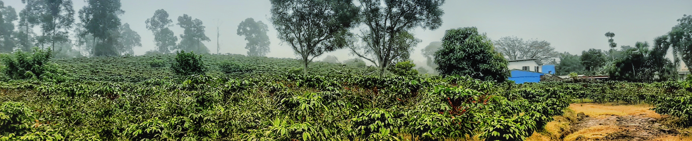

<body style="background-color:#090c12;">
```{r echo=FALSE, layout="l-screen-inset"}
library("knitr")

```
<p style="font-family: times, serif; font-size:40pt; text-align: center; color:#fad905">
    **RESEARCH**
</p>
<p style="font-family: accanthis; font-size:13pt; text-align: center; color:#fce449">
*Evolutionary biology | Phylogenetic comparative methods | Trophic ecology | Macroecology | Systematic literature review | Conservation biology*
</p>

<p style="font-family: accanthis; font-size:14pt; text-align: right; color:white">
**Current projects**
</p>
<p style="font-family: accanthis; font-size:13pt; color:white; text-align: justify">
**Master thesis project.** Coming soon. (2023-present)
</p>

<hr style="border:0.5px solid #3f4a69">
<p style="font-family: accanthis; font-size:15pt; text-align: right; color:white">
**Past projects**
</p>

<p style="font-family: accanthis; font-size:13pt; color:white; text-align: justify">
**Thermal niche diversification in** *Sturnira* **bats (Family Phyllostomidae) and its influence in speciation events.** A study with a phylogenetic and macroecological approach. (2021-2022)
</p>

<br>

<p style="font-family: accanthis; font-size:13pt; color:white; text-align: justify">
**Relation between habitat niche breadth with ecomorphological traits and extinction risk in phyllostomid bats (Family Phyllostomidae).** A research study that utilizes a phylogenetic and geographic approach. (2020-2022)
</p>

<br>

<p style="font-family: accanthis; font-size:13pt; color:white; text-align: justify">
**Effect of habitat disturbance on the abundance of phyllostomid bats (Family Phyllostomidae).** A project with a meta-analysis approach. (2018-2020)
</p>

<p style="font-family: accanthis; font-size:13pt; color:white; text-align: justify">
The loss of tropical forest cover caused by land-use change is causing changes in populations of animal trophic guilds, including those belonging to Phyllostomidae bat species. They fulfill important ecosystem functions such as pollination, seed dispersion, and regulations of vertebrate and invertebrate populations in Neotropical forests and human disturbed habitats. We did an exhaustive literature review, focused on their trophic guild and abundance in disturbed habitat, followed by a series of meta-analyzes. We found that omnivorous, carnivorous, insectivorous and hematophagous bats were sensitive to habitat disturbance, while phytophagous were tolerant. In addition, the type of habitat disturbance and the type of forest where it occurs explain the differences of bat abundance within each trophic guild. These results could focus the conservation efforts of phyllostomid bats and the ecosystem services they provide in both anthropogenic and conserved habitats.
</p>

<center>
{width=60%}
{width=39%}
</center>
<p style="font-family: accanthis; font-size:10pt; color:white; text-align: right">
Source: Carballo-Morales et al., 2021 (see Publications)
</p>